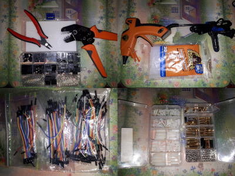

# Kib Bot

## Your cats' best friend

The Kib Bot is a Raspberry Pi integrated into a pet food dispenser. It lets you operate the feeder remotely. It can be modified to perform other functions, like logging and protecting against misclicks.


Connect the Kib Bot to your VPN and operate it away from home! Your cats will love it!


### Requirements

This code will run off of a Raspberry Pi single-board computer that is able to run Flask. It also requires some kind of pet food dispenser, one that you've modified to connect to the Raspberry Pi.

The code uses RPi.GPIO through a motor controller. It could be run on a different machine as long as it's able to control a motor and connect to the internet.

The code also needs to be able to read a pin, assuming your food dispenser uses a switch to detect the motor's position. Any Raspberry Pi or microcontroller can do this.

### Installation

#### Hardware

I used a Yoposl automatic cat feeder I bought off of Amazon.


Place the motor hat on your Raspberry Pi.

Connect the switch to BCM pin 16. Make sure that the switch drives the voltage low when engaged. I feed pin 16 3.3V through a 4.7k ohm resistor. Check with a multimeter what your pet feeder does. You may be able to simply tap into its wiring to get the switch signal.

#### Software

The code is setup as a Flask server.

On a Raspberry Pi, you will have to install some software first.

```
apt install python3-pip python3-venv
```

Then, clone this code in a folder with `git clone`. You can then setup the virtual environment and installed the required packages.

```
cd kibbot
python3 -m venv .venv
. .venv/bin/activate
pip install -r requirements.txt
```

In order to start the web server in development mode,

```
. .venv/bin/activate
flask --app kibbot run --host=0.0.0.0
```

To run using a better server, install gunicorn with `pip install gunicorn`, then use

```
. .venv/bin/activate
gunicorn -w 1 -b 0.0.0.0:5000 kibbot:app
```

Make sure to only use one worker so that there are not multiple requests at once to the dispenser. With only one worker, requests will happen in sequence, and the motor will keep running until it has completed them all.

## Deep dive

### How the automatic feeder works

My automatic feeder is a motor that spins a compartmentalized drum that collects the pet food and dispenses it in portions. There are three protuding rounded corners that presses a switch, which is how the machine knows the position of the drum. One full revolution of the drum dispenses three portions.

The feeder has a screen and some buttons for either automatically feeding portions on a schedule or for initiating manual feedings. The screen locks after a short period. I'm guessing that's to make it harder for a pet to operate the machine.


The feeder has a small coin cell battery to keep the time when powered off. It is also possible to power the machine with three D batteries, like a battery backup.

The feeder is fed by a small 5V 1A charger. The drum motor also runs at 5V. The switch is 3V, so the logic is thereabouts 3.3V. This is worth remembering when playing around with the circuitry.

[To check all of these, connect your multimeter's negative terminal to the feeder's ground. Then connect the positive terminal to the parts you want to measure. Alligator clips or "EZ" clips make this a lot easier.]

### Hardware strategy

A Raspberry Pi computer with a motor controller is ultimately equivalent to the feeder's electronics. It accepts 5V as its power input so it can drive the motor at that voltage through the motor controller. Its logic is at 3.3V so it's able to read the switch the same way.

The Pi has the advantage of being a computer able to run Python and a web server. It can also connect to the internet by wifi. Other add-ons are possible, like a camera, a speaker and a sensor for detecting pellet levels in the reservoir.

### Tools and hardware

I used a [Raspberry Pi Zero 2 W](https://www.raspberrypi.com/products/raspberry-pi-zero-2-w/), which is the cheapest in-stock board I could find. A Pico W would also work, but it's just so much easier (and fun) to use a full Linux machine.

Note: the Raspberry Pi Zero product line does not have a protective fuse, so make sure to give it 5V only. I have fried a Pi Zero by using a fast-charging phone charger, the kind that can go to 12V. I am not sure why the fast-charge mode activated, so I have stuck to regular 5V chargers since.

I use the [Pi Motor Controller HAT](https://www.pishop.ca/product/raspberry-pi-motor-controller-hat/) to control the motor from the Pi. The hat is simply a motor control chip that connect to some of the Pi's pins. Any other motor controller should work. Only one channel is neeeded. The ability to supply a separate 5V voltage is necessary since the motor runs at 5V not the 3.3V of the Pi's GPIO.


La piece de resistance is my dupont connector kit and crimper. This has made everything very easy. With the kit, I was simply able to cut the feeder's wires, put dupont connectors on their ends, and plug them wherever I needed. I use both male and female connectors. Male connectors will fit in breadboards and screw terminals, and female connectors are needed for the Pi. It's a good idea to have an assortment of pre-made Dupont connectors, male-male, male-female, female-female, in case you need to extend a connection or change its connector. A hot glue gun and a Raspberry Pi spacer kit are also helpful for securing components in place.



Last but not least, it's a really good idea to have a multimeter so that you can check your feeder's circuitry. This is my first hardware hack, and it's a pretty basic one; nevertheless, I think it's a good idea to check and write yourself some notes on paper. The manufacturer may designed things in a way you do not expect. Different connectors for your multimeter are helpful: alligator clips and "EZ" clips should be able to latch onto most things.

Anoter helpful thing to have is a camera so that you can take photos of the feeder's assembly, in case you forget how to put it all back together.

### Taking it apart

Most pieces of the feeder come apart easily.

Separating the motor's drum structure was harder. At first I thought it was held by plastic clips, but no mater how hard I tried, I could not pry it loose. I then wondered if the things were held by screws after all. It turned out they were hidden under the feeder's rubber pad or feet. By ripping these off I was able to remove four screws and the feeder came apart.


Inside, wires are soldered to terminals, and there is what looks like a JST header hot-glued to the main board.

There is a white wire heading from the 3 D batteries to the board.

There are pairs of wires each going to the motor and to the lever switch. The motor's rotating structure has corners that press on the switch three times during each complete revolution.

To take this apart, I simply cut all the wires at about midpoint. This left me with

  * a disconnected main board.
  * VCC and ground
  * positive and negative for the motor
  * ground for the switch and a blue wire for the returning signal

I terminated all the wire ends with Dupont connectors. It didn't really matter whether they were male or female connectors. I have plenty of either kind to connect them.

### Putting together the new board

Putting together the new Raspberry Pi setup is not hard provided you have the parts. We just need to control the motor and read the switch to determine the motor's position.

Before that we need to power things. The power supply can be connected to the Pi's 5V and ground pins. On the Pi Zero, these pins are connected to the Pi's power rails, so they're okay to use this way. If this isn't to your liking, I see two alternatives: first, run a 5V power supply with the right connector for your Pi through the back of the feeder, or second wire your own power connector to the VCC and GND in the feeder. You can find USB breakboard boards for micro USB and USB-C to make your life easier.

The motor can be connected to a Motor Pi Hat. Put the hat on the Pi, secure the motor's wires into the screw terminal, and feed 5V into the controller's external voltage.


The switch in the feeder drives its output to ground when pressed, so you will need to drive your Pi's digital input pin high to 3.3V volt with a pull-up resistor (I use 4.7kohm). What this all means is that when the switch is not pressed, your Pi will read ON or HIGH at 3.3V. When the switch is pressed, its connection to ground will drive your input pin to ground along with it: this is thanks to the pull-up resistor that will "weaken" the 3.3V so that the ground signal can easily overwhelm it.

There is an extra wrinkle though: the switch will be noisy, meaning that it will bounce around HIGH and LOW as it switches (or just when it feels like it). This means that it will be hard to detect what the switch is really doing. The noise can be reduced with a 104 ceramic capacitor accross the the input pin and the ground (one leg of the capacitor on the digital pin, the other leg on the ground). The capacitor will even out the power fluctuations. Still, it's worth making your Python code wait a few cycles to make sure a change between HIGH/LOW is genuine.

(I have never been good at diagnosing these noise issues in the past. To do a better job I would need an oscilloscope to measure the fluctuations' frequencies. That would let me select the right capacitor to filter. A multimeter does not update nearly fast enough to get the shape of the noise from the switch. Oscilloscopes takes measurements more than a million times per second and graph them for you.)

### Software strategy

To control the Kibbot I use a very simple Flask server. This puts the the Kibbot on the LAN, and if you have a VPN configured, it also opens up remote control.

Flask is a simple web server. When a visitor requests a URL, the server runs the appropriate Python code. If the user requests a URL or path that does not exist, the server returns an error. So Flask creates a website with some Python code living inside.

The Kibbot simply needs to have a page with a link to dispense food. When the visitor clicks the link, the bot dispenses one portion of food. On the server, Python accesses the Raspberry Pi's GPIO pins. These pins are connected to the motor and the switch, so Python can drive the motor and stop it when necessary.

Controlling the motor is not difficult, thanks to the Motor Pi Hat. The board's GitHub repo has [an example](https://github.com/modmypi/SN754410NE-Motor-Controller/blob/master/pwm_motor.py) you can quickly adapt and use. The RPi.GPIO library already has all it needs, and no additional libraries are necessary. Once the pins are assigned, the code can set the motor's speed. When it's time to stop, the `.stop()` method is called.

```python
# Make it so GPIO pins by their system number, not their position. The two sets
# of numbers are listed on a GPIO pinout.
GPIO.setmode(GPIO.BCM)

# For the motor hat, the BCM pin 17 is the one for moving forward the first
# motor.
M1_F = 17

# Initialize pin 17 as output and then set it for PWN at 1000Hz.
GPIO.setup(M1_F, GPIO.OUT)
m1f = GPIO.PWM(M1_F, 1000)

# Start the motor at 80% load. It will keep running until stopped.
m1f.start(80)

# Stop the motor
m1f.stop()
```

Reading the switch is not difficult, but making use of the signal requires a bit of work.

First, we're interested in the falling edge of the switch's signal, meaning that we want to know when the switch goes from HIGH (unpressed) to LOW (pressed). (Recall that the switch is connected to ground so that it drives the input pin low when pressed.) To do this, we need a while loop that compares the signal from the previous loop.

```python
# Create some variables for tracking the switch in the while loop. When the
# switch is pressed, the voltage drops and `falling` becomes True.
old_switch = GPIO.input(16)
consecutive = 0
falling = None

while True:
  # Read the signal from the switch
  new_switch = GPIO.input(16)

  # If the signal goes from HIGH to LOW,
  # set falling to True
  if new_switch < old_switch:
    falling = True
  # If the signal goes from LOW to HIGH,
  # set falling to False
  elif new_switch > old_switch:
    falling = False

  old_switch = new_switch
```

Second, the signal is noisy despite the capacitor. It will bounce between HIGH and LOW as the switch is pressed. While it might be possible to clean up the signal more with better tools, there is a cheap solution. The code can wait to see if the signal stays high after it detects the rising edge. This introduces a delay but it's fairly reliable.

```python
while True:
  # [...]

  # If the signal is the same as before,
  # increment this counter
  if new_switch == old_switch:
      consecutive += 1
  # Otherwise start counting again
  else:
      consecutive = 0

  # If we've passed the falling edge and it has
  # stayed there for 1000 cycles, terminate
  # the while loop.
  if falling and consecutive > 1000:
      break
```

With these two things together, the operation of the motor and the switch to stop it, the web server can dispense portions of food when the link is clicked.

There are two other things to do: include a log and protect against accidental feedings.

A log is easily made by saving the time of each request to a comma-separated values (CSV) file. This kind of file is very simple, and can be written to directly without much trouble. When the page is displayed, the file is read, parsed and sorted to give the past history. This way you have some idea how often you are feeding your cats.

```python
# During a feeding, save this in our logs
with open("./log.csv", "a") as f:
    f.write(f"{datetime.now().isoformat()},{request.remote_addr},success\n")

# When displaying the page
if os.path.isfile("./log.csv"):
    with open("./log.csv", "r") as f:
        feedings = [x for x in f.readlines() if "success" in x]
        feedings = [x.split(",")[0] for x in feedings]
        feedings = sorted(feedings)
```

Protecting against accidental feedings can be done a few ways. One way is to make the links expire after a short amount of time. In our case, we can just put a timestamp at the end of each link and check that the timestamp is recent when evaluating the request. If a request uses a timestamp that is too old, the request fails. The `datetime` standard library makes this easy with its time deltas, [particularly their ability to divide each other](https://docs.python.org/3/library/datetime.html#datetime.timedelta.total_seconds). By subtracting the timestamp from the current time, we get a delta we can divide by `timedelta(minutes=1)` to get the minutes elapsed. If the result is great than 1, return an error.

```python
@app.route("/kib/<int:today>")
def kib(today):
    # Link expires after about a minute, ie: link must be within one
    # minute of current kibbot time
    if (int(datetime.now()) - datetime.fromisoformat(today)) / timedelta(minutes=1) > 1:
      return "Invalid kibble request", 400
```

Another way is to use the `flask-limiter` library to limit how many times a route can be used.

### A systemd service

It is very convenient to have the Flask server start automatically whenever the Kibbot is pluged in. This can be done with a systemd service that starts the server as Linux starts. This means you don't have to SSH into the Kibbot each time you want to start it.

You can find a good guide [here](https://github.com/torfsen/python-systemd-tutorial) for turning a Python script into a systemd service.

Place the following in `~/.config/systemd/USER/kibbot.service`

```
[Unit]
Description=Kib Bot food dispenser
After=network.target

[Service]
WorkingDirectory=/home/ubuntu/kibbot
ExecStart=/home/ubuntu/kibbot/.venv/bin/gunicorn -b 0.0.0.0:5000 -w 1 kibbot:app
Environment=PYTHONUNBUFFERED=1
Restart=on-failure

[Install]
WantedBy=default.target
```

Then run to start

```
systemctl --user enable kibbot
systemctl --user start kibbot
```

You should also run this to let the service continue even when you aren't logged in

```
sudo loginctl enable-linger $USER
```

### A bash script for remote trigger

You can access the flask server from outside a browser. A bash script can make the GET request to trigger the feeding.

```bash
#!/bin/bash
page=$(date +%Y%m%d%H%M%S)

wget -O- http://192.168.xxx.xxx:5000/kib/${page}
```

The above script can be used in motioneye to [add an action button](https://github.com/motioneye-project/motioneye/wiki/Action-Buttons) to start a feeding. Since this technique generates the timestamp from the remote machine's time, it may be too far off from the Kibbot's and always cause a failure.

## Questions? Comments?

If you have any questions or comments, feel free to reach out to me.
